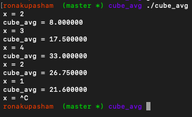
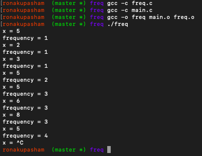

Write reactive kernel for finding
1. Mean of cubes
2. Frequency of first element in a series

## I. Mean of cubes
At each step, input is a single integer x. Mean of cubes has to be found for a sequence of x’s seen so far. Following is the expected output:

```bash
cd </path/to/cube_avg>
gcc -c cube_avg.c
gcc -c main.c
gcc -o cube_avg main.o cube_avg.o
./cube_avg
```

## II. Frequency of first element in a series:
At each step, input is a single integer x. You have to calculate the number of times the first element of the series is occurring in a series of inputs Following is the expected output:

```bash
cd </path/to/freq>
gcc -c freq.c
gcc -c main.c
gcc -o freq main.o freq.o
./freq
```

## Submission Instructions
- This assignment is an individual task
- Complete the necessary files given in the folder
- Compress the folder Assignment-1 in a .tar.gz file and provide the name as <rollno>_Assignment_1.tar.gz
- Submit it on moodle
