# Line-Following Robot: Strategy, Assumptions, and Statechart Description
### Submitted vy
- Sm Arif Ali   (23m0822)
- Soumik Dutta  (23m0826)
- Arnab Bhakta  (23m0835)
- Santanu Sahoo (23m0777)

[**Stately link**](https://stately.ai/registry/editor/35e1667e-35bd-40af-9ec0-f90c0c0b90f8?machineId=0b96c031-b5e9-4d21-8903-925529c2fd66&mode=Design)  
[**YouTube demo video link**](https://youtu.be/Gxr1A2trK5A)

## Strategy Used

The line-following robot operates by continuously reading sensor inputs to determine its position relative to the track. Based on the sensor readings, the robot transitions between different movement states to follow the black line. The core strategy includes:

1. **Sensor-Based Navigation**: Five sensors detect the presence of the black line and intersections.
2. **State-Based Control**: The robot transitions through predefined states based on sensor readings.
3. **Directional Movement**: The robot moves straight, left, or right depending on the detected line position.
4. **Handling Intersections**: Special states exist to handle intersections and deviations.
5. **Stopping at the End**: The robot stops when it detects the end of the track.
6. **Recovery Mechanism**: If the robot moves out of the track area, it performs a 180-degree turn to reattempt following the line.

## Assumptions Made

- The robot operates on a black line on a white background.
- The five sensors provide a binary representation of the line's position.
- The motor speeds and movement durations for precise turns are predetermined based on real-world testing.
- Movement execution relies on a time-based approach for turning angles:
  - **90-degree turn**: The robot moves for a specific duration at a controlled speed to achieve a precise right-angle turn.
  - **180-degree turn**: The robot rotates for a longer duration to execute a full turnaround.
- The specific values for speed and movement duration depend on the physical characteristics of the motors and the robot's mechanical setup.
- The track doesn't have any counter-clock wise (left turning) loop.

## Description of the Statechart

The robot follows a hierarchical statechart with the following main components:

### 1. **Idle State**
- The robot starts in the `idle` state.
- On receiving the `Start` event, it transitions to `sensorDetection`.

### 2. **Sensor Detection State**  
- The robot reads the five sensor values.  
- Sensor outputs range from **0 to 1023**:  
  - If **reading > 500**, it is treated as **1** (line detected).  
  - If **reading ≤ 500**, it is treated as **0** (no line detected).  
- The **five sensor readings** are **combined into a single 5-bit binary value**, read from **left to right**.  
- Based on this **5-bit input**, the robot determines the next movement:  
  - Move **straight** when the center sensor detects the line.  
  - Turn **left** or **right** when side sensors detect deviation.  
  - Special cases for **intersections**.  
  - **Stop** if all sensors detect the end of the track.

### 3. **Movement States**
- `MoveStraight`, `MoveLeft`, `MoveRight` and `Rotate180` states correspond to respective motor actions.
- Each movement state is executed for a predefined duration before returning to sensor detection.
- Turns (90-degree and 180-degree) are performed by running the motors for a specific time at a controlled speed.

### 4. **Handling Out-of-Track Situations**
- If all sensors detect white (`00000`), the robot assumes it has left the track.
- It executes a 180-degree turn by rotating in place for a fixed duration before reattempting line following.

### 5. **Final State**
- When the robot detects the end of the track (`11111`), it enters the `Finished` state and stops all movement.

## Input-Output Table

| Sensor Input | Event Name | Intersection/Straight Type    | Robot Action         | Motor Output |
|--------------|------------|--------------------------------------|----------------------|--------------|
| `00100`      | Event S    | Straight Path         | Move Straight        | Both motors forward |
| `11000`      | Event L    | Only Left turn        | Turn Left            | Right motor forward, left motor stopped |
| `00011`      | Event R    | Only Right turn       | Turn Right           | Left motor forward, right motor stopped |
| `11011`      | Event LR   | Left turn or Right turn | Prioritize Left Turn | Right motor forward, left motor stopped |
| `11100`      | Event LS   | Left or straight at an intersection | Left or Straight     | Depends on further detection |
| `00111`      | Event SR   | Straight or right at an intersection | Straight or Right    | Depends on further detection |
| `11111`      | End        | Stop at the end of the path         | Stop                 | Both motors stop |
| `00000`      | OutOfArea  | Rotate 180 degrees when out of area | Rotate 180 degrees   | Both motors in opposite directions |

## Conclusion

This report outlines the strategy, assumptions, and implementation details of the statechart used in the line-following robot. Key considerations such as sensor interpretation, movement execution, and turn timing are determined by real-world motor specifications. Future refinements could include dynamic speed adjustments for smoother navigation.

## Contributions
- Brainstorming: whole team
- Stately Chart prepare: Arnab
- Document: Arif
- Video recording: Soumik

